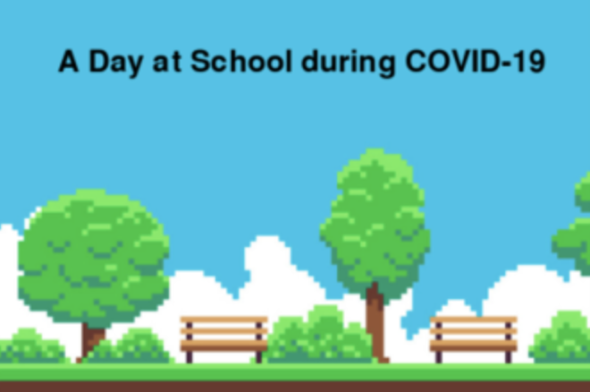

<!-- contact shields -->
[gmail-shield]: https://img.shields.io/badge/Gmail-D14836?style=for-the-badge&logo=gmail&logoColor=white
[gmail-url]: mailto:theivikaran.jathurshan@gmail.com
[outlook-shield]: https://img.shields.io/badge/Microsoft_Outlook-0078D4?style=for-the-badge&logo=microsoft-outlook&logoColor=white
[outlook-url]: mailto:jtheiv@outlook.com
[linkedin-shield]: https://img.shields.io/badge/LinkedIn-0077B5?style=for-the-badge&logo=linkedin&logoColor=white
[linkedin-url]: https://linkedin.com/in/jathurshan-t
[github-shield]: https://img.shields.io/badge/GitHub-8631A9?style=for-the-badge&logo=github&logoColor=white
[github-url]: https://github.com/jath-git?tab=repositories

<!-- project summary shields -->
[contributors-shield]: https://img.shields.io/github/contributors/jath-git/Hack-The-North-2021.svg?style=for-the-badge
[contributors-url]: https://github.com/jath-git/Hack-The-North-2021/graphs/contributors
[stars-shield]: https://img.shields.io/github/stars/jath-git/Hack-The-North-2021.svg?style=for-the-badge
[stars-url]: https://github.com/jath-git/Hack-The-North-2021/stargazers

<!-- programming language shields -->
[python-shield]: https://img.shields.io/badge/Python-3776AB?style=for-the-badge&logo=python&logoColor=white
[javascript-shield]: https://img.shields.io/badge/JavaScript-F7DF1E?style=for-the-badge&logo=javascript&logoColor=black
[c++-shield]: https://img.shields.io/badge/C%2B%2B-00599C?style=for-the-badge&logo=c%2B%2B&logoColor=white
[c#-shield]: https://img.shields.io/badge/C%23-239120?style=for-the-badge&logo=c-sharp&logoColor=white
[html-shield]: https://img.shields.io/badge/HTML5-E34F26?style=for-the-badge&logo=html5&logoColor=white
[css-shield]: https://img.shields.io/badge/CSS3-1572B6?style=for-the-badge&logo=css3&logoColor=white

<!-- start document -->
<div id="start"></div>

<!-- contact info -->
[![Gmail][gmail-shield]][gmail-url]
[![Outlook][outlook-shield]][outlook-url]
[![LinkedIn][linkedin-shield]][linkedin-url]
[![GitHub][github-shield]][github-url]

<!-- project overview -->
<br />
<div align="center">
  <!-- project image -->
  <a href="https://github.com/jath-git/Hack-The-North-2021">
    
  </a>

  <h3>Dodge the Virus</h3>
  <!-- languages used in project -->
  <div>
    
    
  </div>
  <!-- project description -->
    <p>
    An educational game about COVID-19. Designed sequence of interactive minigames.
    <br />
    </p>
</div>

## Getting Started
* [Python 3.7 or latest version](https://www.python.org/downloads/)
* Latest version of pip
    ```sh
    curl https://bootstrap.pypa.io/get-pip.py -o get-pip.pycurl https://bootstrap.pypa.io/get-pip.py -o get-pip.py
    python3 get-pip.py
    ```
* Latest version of pygame
    ```sh
    pip3 install pygame
    ```

## Instructions
* Run program
```sh
python3 game.py
```

<!-- project summary -->
[![Contributors][contributors-shield]][contributors-url]
[![Stargazers][stars-shield]][stars-url]
<p align="center"><a href="#start">back to top</a></p>